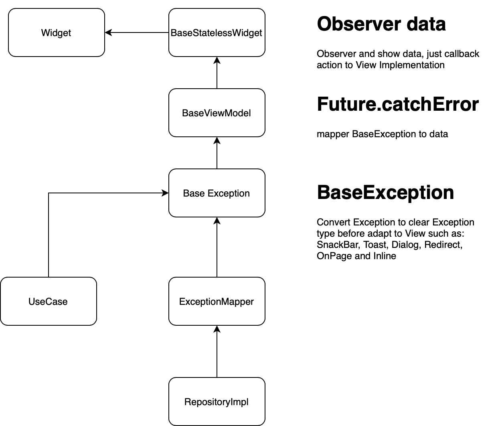
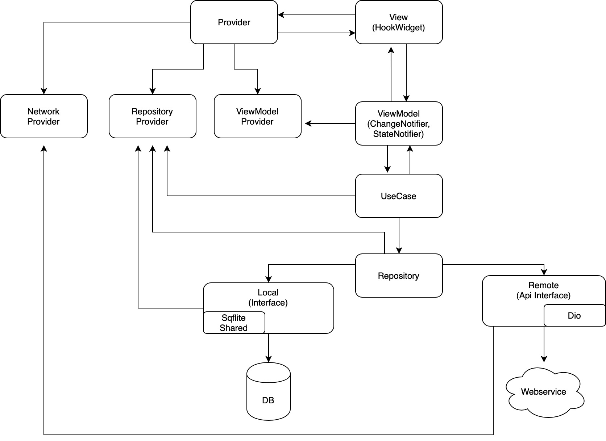
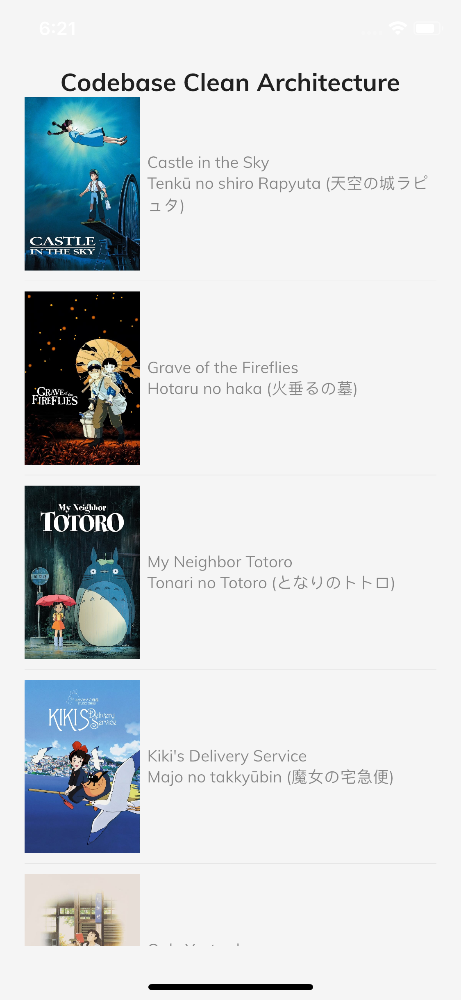

# Flutter Boilerplate

A Flutter codebase follows the clean architecture and makes it scalable with a modularization approach.  

```bash
    - Flutter v3.x.x
    - Clean Architecture
    - Presentation use Bloc
```

## Technical architecture components

- Clean Architecture
- Dart rule analyze: flutter_lints
- State management: flutter_bloc
- Dependency injection: get_it & injectable_generator
- Network: Dio &  Retrofit
- Manage fonts and images: flutter_gen

## Environment

**Framework**:

- Dart: '>=2.18.0 <3.0.0'
- Flutter: '>=3.0.0'

**iOS**:

- iOS 12+

**Android**:

- Android 7.0+
- minSdkVersion 24
- targetSdkVersion 34

## Getting Started

A few resources to get you started if this is your first Flutter project:

- [Lab: Write your first Flutter app](https://docs.flutter.dev/get-started/codelab)
- [Cookbook: Useful Flutter samples](https://docs.flutter.dev/cookbook)

For help getting started with Flutter development, view the
[online documentation](https://docs.flutter.dev/), which offers tutorials,
samples, guidance on mobile development, and a full API reference.

## Run App

`Please turn on your simulator or connect with your physical device before:`

- Set up to run:

```bash
    flutter clean
    flutter pub get
    flutter pub run build_runner build --delete-conflicting-outputs
```

- Run with Flavor (dev | stag | prod):

```bash
    fvm flutter run --flavor development -t lib/main.dev.dart
```

or

```bash
    fvm flutter run --flavor staging -t lib/main.staging.dart
```

or

```bash
    fvm flutter run --flavor product -t lib/main.product.dart
```

- If using the another library not build with null-safety. Please run with argument `flutter run --no-sound-null-safety`

## Build Release

- Android:

```bash
    flutter build apk 
```

- iOS:

```bash
    flutter build ios
```

## General NOTE

**Code style:**

- [Effective Dart](https://dart.dev/guides/language/effective-dart)
**If added some assets/fonts/colors**
- Use [FlutterGen](https://github.com/FlutterGen/flutter_gen/)
**If added some models for api results**
- [Equatable](https://pub.dev/packages/equatable) and [json_annotation](https://pub.dev/packages/json_annotation)
**Auto generate resource(_**.g.dart/**_.freezed.dart)**

```bash
fvm flutter gen-l10n
fvm dart run build_runner build --delete-conflicting-outputs 
```

Using this in case error with cache:

```bash
fvm dart run build_runner clean
```

## Project struct

- I use `BLOC` pattern and `MVVM` + `Clean Architechture`
- `FLUTTER BLOC` -> <https://pub.dev/packages/flutter_bloc>
(PRESENT UI Layer > Business Logic (BLOC or Change notifier) -> REPOSITORY -> DATABASE or SERVICE -> ENTITIES)
- Feel free to use `ChangeNotifier` in any simple usecase.
- Please push share data model class in `entities` package
- App features are located in `modules` package. One feature per sub-module package (please see the `template`)

### Dependency Injection

- I use get_it package for Dependency Injection -> <https://pub.dev/packages/get_it>
- With help of injectable to generate the DI code <https://pub.dev/packages/injectable>
or <https://blog.usejournal.com/flutter-di-a-true-love-story-1e5a5ae2ba2d>

### Networking layer

- I use dio_builder.dart as a `dio` client generator using `source_gen` and inspired by Chopper and Retrofit.
  - About `Retrofit`: <https://pub.dev/packages/retrofit> and <https://mings.in/retrofit.dart/>
  - About `dio`: <https://pub.dev/packages/dio>
  - Too lazy to repeat write network layer ? You could try to do it for us `retrofit-generator` <https://pub.dev/packages/retrofit_generator>
  - To use `source_gen`, please read here: <https://medium.com/flutter-community/part-2-code-generation-in-dart-annotations-source-gen-and-build-runner-bbceee28697b>
    and <https://github.com/dart-lang/build/blob/master/docs/writing_a_builder.md#configuring-outputs>

### Codebase Overview

This is a diagram that I drew to design and describe this codebase. (to view PDF version )

```cmd
lib
├── gen
│   ├── l10n
│   │   ├── res_en.dart
│   │   ├── res_vi.dart
│   │   └── res.dart
│   ├── assets.gen.dart
│   ├── colors.gen.dart
│   └── fonts.gen.dart
├── res
│   ├── res_en.arb
│   └── res_vi.arb
├── src
│   ├── core
│   │   ├── base
│   │   │   ├── base_exception_mapper.dart
│   │   │   ├── data_model.dart
│   │   │   ├── entity_item.dart
│   │   │   └── model_item_mapper.dart
│   │   ├── config
│   │   │   ├── app_config.dart
│   │   │   ├── constants.dart
│   │   │   ├── environment.dart
│   │   │   └── themes.dart
│   │   ├── di
│   │   │   ├── dependency_injection.config.dart
│   │   │   ├── dependency_injection.dart
│   │   │   └── locator.dart
│   │   ├── error_handles
│   │   │   ├── alert_exception.dart
│   │   │   ├── app_error.dart
│   │   │   ├── base_exception.dart
│   │   │   ├── inline_exception.dart
│   │   │   ├── on_page_exception.dart
│   │   │   ├── redirect_exception.dart
│   │   │   ├── snack_bar_exception.dart
│   │   │   └── toast_exception.dart
│   │   ├── mapper
│   │   │   ├── exception_mapper.dart
│   │   │   ├── mapper.dart
│   │   │   └── resource_mapper.dart
│   │   ├── models
│   │   │   ├── dialog.dart
│   │   │   ├── error_data_model.dart
│   │   │   ├── error_data_model.g.dart
│   │   │   ├── models.dart
│   │   │   └── tag.dart
│   │   ├── providers
│   │   │   ├── local
│   │   │   │   ├── pref
│   │   │   │   │   ├── app_pref.dart
│   │   │   │   │   └── pref_helper.dart
│   │   │   │   └── app_storage.dart
│   │   │   ├── remote
│   │   │   │   ├── builder
│   │   │   │   │   └── dio_builder.dart
│   │   │   │   ├── interceptor
│   │   │   │   │   └── header_interceptor.dart
│   │   │   │   └── response
│   │   │   │       ├── errors_response.dart
│   │   │   │       └── errors_response.g.dart
│   │   │   └── providers_module.dart
│   │   ├── services
│   │   │   ├── request_permission.dart
│   │   │   └── socket.dart
│   │   ├── types
│   │   │   ├── action.dart
│   │   │   ├── direction_type.dart
│   │   │   ├── exception_type.dart
│   │   │   ├── redirect_type.dart
│   │   │   └── tag_type.dart
│   │   ├── utils
│   │   │   ├── extensions
│   │   │   │   ├── async_snapshot.dart
│   │   │   │   ├── build_context.dart
│   │   │   │   └── context.dart
│   │   │   ├── app_lifecycle.dart
│   │   │   ├── app_size.dart
│   │   │   ├── bloc_observer.dart
│   │   │   └── utils.dart
│   │   ├── core.dart
│   │   ├── endpoints.dart
│   │   └── usecase.dart
│   ├── modules
│   │   ├── app
│   │   │   ├── bloc
│   │   │   │   ├── language_bloc.dart
│   │   │   │   ├── language_event.dart
│   │   │   │   └── language_state.dart
│   │   │   ├── app.dart
│   │   │   └── routes.dart
│   │   ├── authentication
│   │   │   ├── data
│   │   │   │   └── data.dart
│   │   │   ├── domain
│   │   │   │   └── domain.dart
│   │   │   └── presentation
│   │   │       ├── bloc
│   │   │       │   ├── auth_bloc
│   │   │       │   │   ├── auth_bloc.dart
│   │   │       │   │   ├── auth_event.dart
│   │   │       │   │   └── auth_state.dart
│   │   │       │   └── profile_bloc
│   │   │       │       ├── profile_bloc.dart
│   │   │       │       ├── profile_event.dart
│   │   │       │       └── profile_state.dart
│   │   │       ├── forgot_password
│   │   │       │   └── forgot_password_screen.dart
│   │   │       ├── login
│   │   │       │   └── login_screen.dart
│   │   │       ├── profile
│   │   │       │   └── profile_screen.dart
│   │   │       └── register
│   │   │           └── register_screen.dart
│   │   ├── common_widgets
│   │   │   ├── app_indicator.dart
│   │   │   ├── avatar_circle_edit.dart
│   │   │   ├── avatar_circle.dart
│   │   │   ├── loading_popup.dart
│   │   │   ├── popup_modal_custom_content.dart
│   │   │   ├── popup_notification.dart
│   │   │   └── popup.dart
│   │   ├── home
│   │   │   ├── data
│   │   │   │   ├── mappers
│   │   │   │   │   └── fiml_mapper.dart
│   │   │   │   ├── models
│   │   │   │   │   ├── film_model.dart
│   │   │   │   │   ├── film_model.g.dart
│   │   │   │   │   └── models.dart
│   │   │   │   ├── remote_source
│   │   │   │   │   ├── api
│   │   │   │   │   │   ├── film_api.dart
│   │   │   │   │   │   └── film_api.g.dart
│   │   │   │   │   └── response
│   │   │   │   │       ├── film_response.dart
│   │   │   │   │       └── film_response.g.dart
│   │   │   │   └── repository_implementations
│   │   │   │       └── film_repository_impl.dart
│   │   │   ├── domain
│   │   │   │   ├── entities
│   │   │   │   │   └── film_entity.dart
│   │   │   │   ├── repositories
│   │   │   │   │   └── film_repository.dart
│   │   │   │   └── usecases
│   │   │   │       └── film_usecases.dart
│   │   │   └── presentation
│   │   │       ├── bloc
│   │   │       │   └── film_bloc
│   │   │       │       ├── film_bloc.dart
│   │   │       │       ├── film_event.dart
│   │   │       │       └── film_state.dart
│   │   │       ├── detail_film_screen
│   │   │       │   └── detail_film_screen.dart
│   │   │       └── home_screen
│   │   │           └── home_screen.dart
│   │   └── splash
│   │       └── splash.dart
│   └── main.dart
├── main.dev.dart
├── main.product.dart
└── main.staging.dart
```

**Exception Flow**
    

## Architecture overview

It is architecture based on [MVVM](https://en.wikipedia.org/wiki/Model%E2%80%93view%E2%80%93viewmodel), [CleanArchitecture](https://blog.cleancoder.com/uncle-bob/2012/08/13/the-clean-architecture.html) and the blog by [Reso Coder's Flutter Clean Architecture](https://resocoder.com/2019/08/27/flutter-tdd-clean-architecture-course-1-explanation-project-structure/). The main focus of the architecture is separation of concerns and scalability.  I will apply this diagram to my mudules in my project.


Every "feature" of the app, like sign in with email and password, will be divided into 3 layers - `presentation`, `domain` and `data`.

**The Dependency Rule**

`Source code dependencies only point inwards`. This means inward modules are neither aware of nor dependent on outer modules. However, outer modules are both aware of and dependent on inner modules. The more you move inward, the more abstraction is present. The outer you move the more concrete implementations are present.

> IMPORTANT : Domain represents the inner-most layer. Therefore, it the most abstract layer in the architecture.

**Layers**

1. Domain
   It will contain only the core business logic (use cases) and business objects (entities). It should be totally independent of every other layer.

   
   - `UseCase`: Classes which encapsulate all the business logic of a particular use case of the app (e.g. FetchProfile or UpdateProfile).
   - `Entities`: Business objects of the application
   - `Repositories`: Abstract classes that define the expected functionality of outer layers (`data` layer).

   I create an abstract Repository class defining a contract of what the Repository must do - this goes into the domain layer. I then depend on the Repository "contract" defined in `domain`, knowing that the actual implementation of the Repository in the `data` layer will fullfill this contract.
   > NOTE: Dependency inversion principle is the last of the SOLID principles. It basically states that the boundaries between layers should be handled with interfaces (abstract classes in Dart).

2. Data:
   Consists of a **Repository implementation** (the contract comes from the `domain` layer) and data sources - one is usually for getting remote (API) data and the other for caching that data.

   
   - `Repositories`: Every Repository should implement Repository from the `domain` layer.
   - `Datasources`:
      - _remote_ : responsible for any API call.
      - _local_ : reposible for caching data in local database (e.g SQLite, shared_preferences)
   - `Models`: Extensions of `Entities` with the addition of extra members that might be platform-dependent. For example, in the case of parse json Oject from reponse's server, this can be add some specific functionality (toJson, fromJson) or additional fields database.
   > NOTE: You may notice that data sources don't return `Entities` but rather `Models`.

   > **Data Flow Detail:**
   

3. Presentation:
   Contains the UI and the event handlers of the UI.

   

## Example



